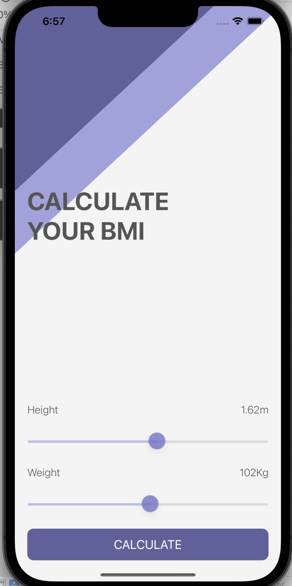

## Description

With this app, you can get data on the Body Mass Index BMI (BMI) calculator, which allows you to determine if you are at a normal weight. Body mass (BMI) calculates body mass index and height. This indicator lets you know if your weight is within the normal range.

